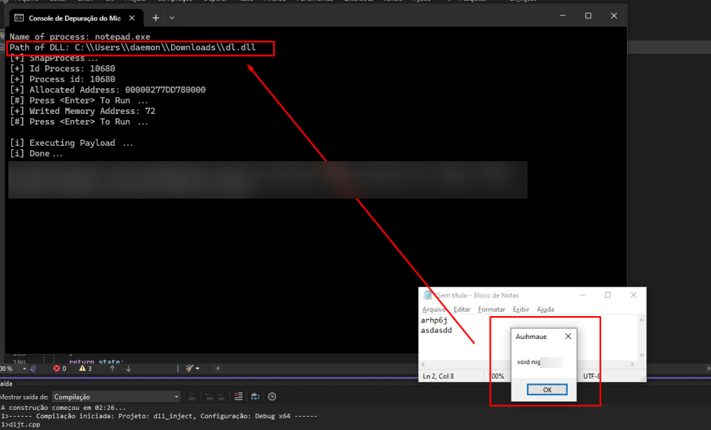

# Obter o Snapshot
Obtém um snapshot de todos os processos no sistema atual
- Usando: 
	- [PROCESSENTRY32](https://learn.microsoft.com/en-us/windows/win32/api/tlhelp32/ns-tlhelp32-processentry32) 
	- [CreateToolhelp32Snapshot](https://learn.microsoft.com/en-us/windows/win32/api/tlhelp32/nf-tlhelp32-createtoolhelp32snapshot)

 
Valida com o processo que estamos procurando
- Usando: 
	- [Process32First](https://learn.microsoft.com/en-us/windows/win32/api/tlhelp32/nf-tlhelp32-process32first)
	- [Process32Next](https://learn.microsoft.com/en-us/windows/win32/api/tlhelp32/nf-tlhelp32-process32next)

 
Abre o processo e retorna
- Usando:
	- [OpenProcess](https://learn.microsoft.com/en-us/windows/win32/api/processthreadsapi/nf-processthreadsapi-openprocess)

# Injetando no processo
Pega o endereço de `LoadLibraryW`
- Usando: 
	- [GetProcAddress](https://learn.microsoft.com/en-us/windows/win32/api/libloaderapi/nf-libloaderapi-getprocaddress)
	- [GetModuleHandleW](https://learn.microsoft.com/en-us/windows/win32/api/libloaderapi/nf-libloaderapi-getmodulehandlew)

 
Aloca o buffer a ser escrito o payload
- Usando:
	- [VirtualAllocEx](https://learn.microsoft.com/en-us/windows/win32/api/memoryapi/nf-memoryapi-virtualallocex)

 
Escreve no buffer alocado
- Usando:
	- [WriteProcessMemory](https://learn.microsoft.com/en-us/windows/win32/api/memoryapi/nf-memoryapi-writeprocessmemory)

 
Executa o payload carregando a dll e criando uma thread remota
- Usando:
	- [CreateRemoteThread](https://learn.microsoft.com/en-us/windows/win32/api/processthreadsapi/nf-processthreadsapi-createremotethread)
